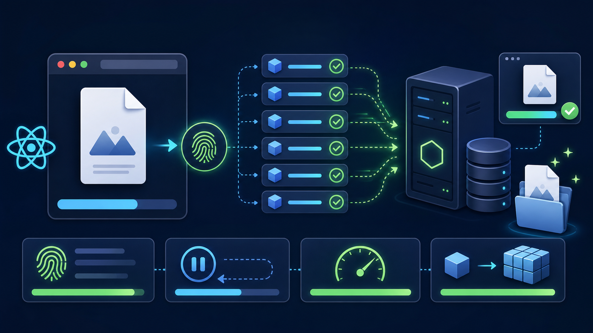
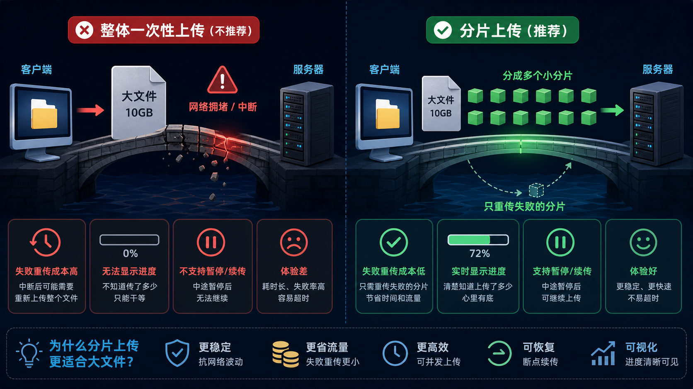
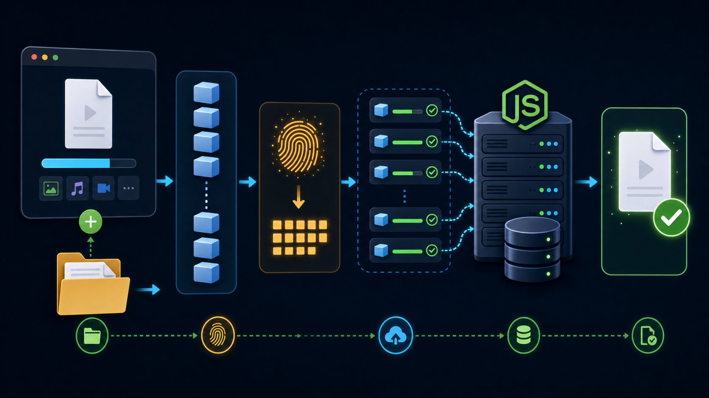
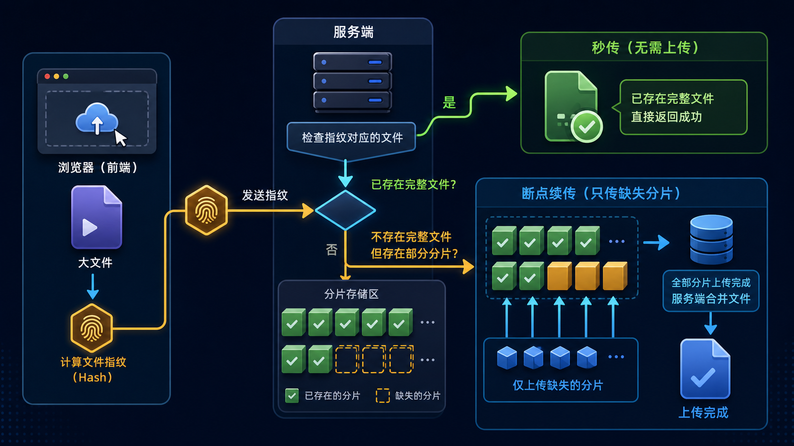
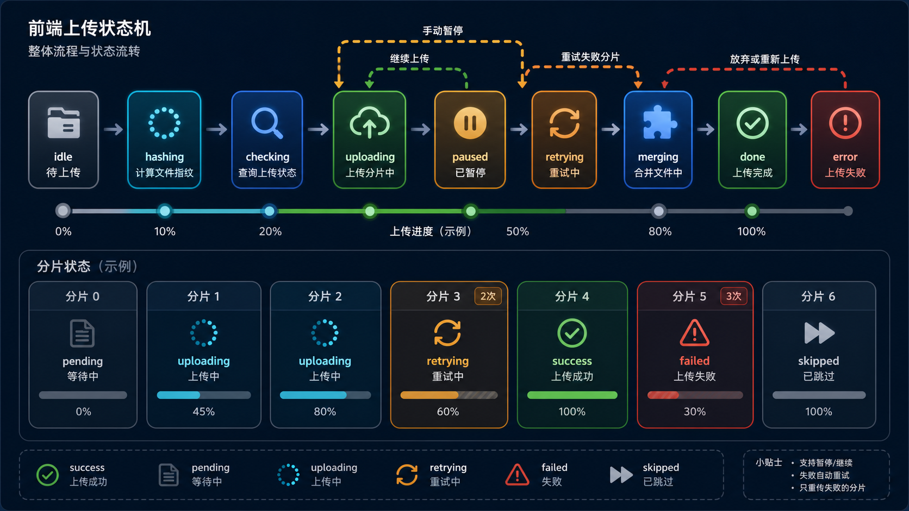
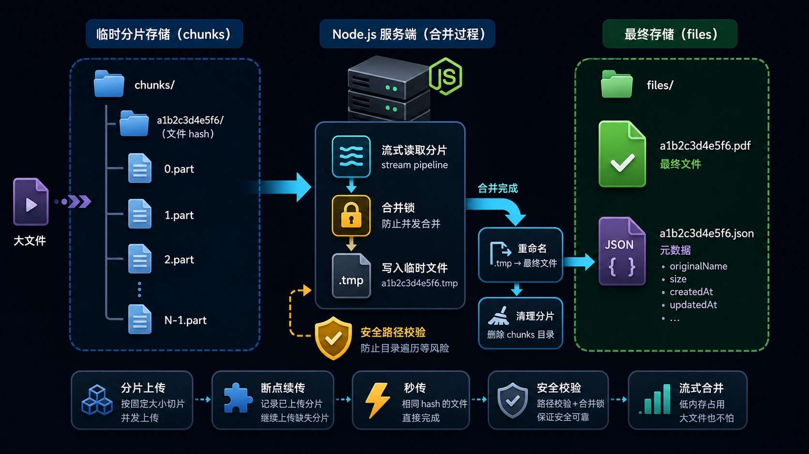

# 从 0 到 1 实现大文件上传：分片、秒传、断点续传、暂停、重试与服务端合并



这篇文章会用一个完整的前后端项目，带你从头理解“大文件上传”到底是怎么实现的。项目路径是：

```bash
/Users/zz/AI learning/vibe coding2/large-file-upload-demo
```

项目使用 React + Vite 做前端，Node.js 原生 HTTP 模块做后端。前端负责选择文件、切片、计算 hash、上传分片、显示进度、暂停继续和失败重试；后端负责判断是否秒传、记录已经上传的分片、流式保存分片、合并文件和返回文件列表。

如果你是初学者，不用担心这套东西看起来名词很多。我们会从最朴素的问题开始讲：为什么普通上传不适合大文件？为什么要切片？为什么要 hash？为什么能断点续传？后端为什么不能直接把所有数据读到内存里？一步一步拆开之后，你会发现大文件上传并不是魔法，而是一组很朴素的工程动作。

## 目录

1. 为什么普通上传不适合大文件
2. 大文件上传的核心思路
3. 本项目实现了哪些能力
4. 整体流程图
5. 前端第一步：选择文件并切片
6. 前端第二步：用 Web Worker 计算文件 hash
7. 前端第三步：查询服务端状态，实现秒传和断点续传
8. 前端第四步：用 XHR 上传分片并显示实时进度
9. 前端第五步：并发上传、暂停、继续和失败重试
10. 后端第一步：接口设计
11. 后端第二步：用 Busboy 流式接收分片
12. 后端第三步：按 hash 存储分片和最终文件
13. 后端第四步：合并分片，并保证合并过程可靠
14. 页面状态和分片状态怎么设计
15. 完整上传流程走一遍
16. 初学者常见问题
17. 这套方案还能怎么优化
18. 总结

## 1. 为什么普通上传不适合大文件

我们先想一个最简单的上传方式。用户选择一个文件，前端把整个文件塞进 `FormData`，然后发给后端：

```ts
const formData = new FormData();
formData.append('file', file);
await fetch('/upload', {
  method: 'POST',
  body: formData,
});
```

如果文件只有几十 KB、几 MB，这样做当然没问题。很多头像上传、图片上传、普通表单附件上传都是这么做的。

但是当文件变成 500 MB、1 GB、5 GB 时，问题就开始出现了。

第一个问题是上传时间太长。网络稍微慢一点，一个大文件可能要传几分钟，甚至几十分钟。中途用户切换网络、关闭页面、电脑休眠、接口超时，都可能导致上传失败。

第二个问题是失败成本太高。如果你上传一个 1 GB 文件，已经传到了 99%，结果最后网络抖了一下失败了。普通上传往往只能从头再来，前面传的 990 MB 都白费了。

第三个问题是用户看不到细节。一个巨大请求正在发送，前端很难告诉用户“第几段成功了、失败的是哪一段、能不能重试、能不能暂停”。用户只看到一个进度条，心里没底。

第四个问题是后端压力大。如果后端处理方式不当，把整个文件都读进内存，再写入磁盘，那么并发几个大文件上传就可能把内存打爆。

所以，大文件上传的核心不是“怎么把一个文件传上去”这么简单，而是要解决一组工程问题：

- 上传失败后不要从头再传。
- 用户暂停后可以继续。
- 页面刷新后还能找回已经上传的部分。
- 同一个文件已经上传过时可以直接秒传。
- 前端能显示真实进度。
- 后端能稳定处理大文件，不轻易占满内存。

这就是我们为什么要做“分片上传”。



上图可以理解成一个很直观的比喻：不要试图把一个巨大的箱子一次性搬过窄桥，而是把它拆成很多小箱子。小箱子更容易搬，某个小箱子掉了，只需要重新搬这一个，不需要把所有箱子重新搬一遍。

## 2. 大文件上传的核心思路

大文件上传最核心的思路可以总结成一句话：

> 前端把大文件切成很多小分片，逐个或并发上传给后端，后端保存这些分片，等分片都齐了再按顺序合并成原文件。

听起来很简单，但要让它真正好用，还需要补几个关键能力。

第一个关键能力是“文件唯一标识”。后端怎么知道用户这次选的文件，和上次没传完的文件是同一个？不能只靠文件名，因为用户可能改名。也不能只靠修改时间，因为复制文件或者系统操作都可能改变修改时间。比较可靠的方式是根据文件内容计算一个 hash。本项目用的是 `spark-md5`。只要文件内容一样，算出来的 hash 就一样。

第二个关键能力是“分片编号”。一个文件被切成很多分片，每个分片都要有自己的下标，比如 `0`、`1`、`2`。后端保存时就可以放成 `0.part`、`1.part`、`2.part`。合并时按下标从小到大写入，就能恢复原来的文件顺序。

第三个关键能力是“上传前查询状态”。前端不要一上来就开始传，而是先问服务端：“这个 hash 的文件你有没有？如果没有，已经有哪些分片？”服务端如果发现完整文件已经存在，就告诉前端不用传了，这就是秒传。如果完整文件不存在，但有部分分片，就告诉前端已上传分片列表，前端只补传缺失分片，这就是断点续传。

第四个关键能力是“上传过程可控”。前端要知道每个分片是否正在上传、是否成功、是否失败、失败后重试了几次。这样才能做暂停、继续、重试和清晰的进度展示。

第五个关键能力是“后端流式处理”。分片虽然比完整文件小，但也可能有几 MB、几十 MB。后端最好边接收边写磁盘，不要先把整个请求体全部放进内存。

## 3. 本项目实现了哪些能力

当前项目已经实现了比较完整的一套流程：

- 文件按 2 MB 切片。
- 使用 Web Worker + `spark-md5` 计算文件内容 hash。
- 使用 hash 作为文件唯一标识。
- 上传前调用 `/api/upload/status` 查询服务端状态。
- 如果完整文件已存在，直接秒传。
- 如果部分分片已存在，只上传缺失分片。
- 使用 `XMLHttpRequest` 上传分片，以便拿到实时上传进度。
- 支持 1 到 6 个并发上传，页面可调节并发数。
- 支持暂停上传，暂停时中断当前 XHR 请求。
- 支持继续上传，继续时重新查询服务端分片状态。
- 单个分片失败后最多自动重试 3 次。
- 页面展示 hash 计算进度、上传进度、实时速度、分片状态和服务端文件列表。
- 后端使用 `Busboy` 流式接收 multipart 文件。
- 分片按 `chunks/<fileHash>/<index>.part` 保存。
- 最终文件按 `files/<fileHash>.<suffix>` 保存。
- 合并时先写 `.tmp` 文件，成功后再 `rename` 成最终文件。
- 后端有基础路径安全处理，避免路径穿越。
- 后端测试覆盖了流式保存、合并、缺失分片、幂等合并和路径安全。

这个项目不是只写了一个 demo 页面，而是把前端和后端的主要链路都跑通了。

## 4. 整体流程图



整体流程可以分成 6 步：

1. 用户选择文件，浏览器拿到 `File` 对象。
2. 前端根据固定大小，比如 2 MB，把文件切成多个分片。
3. 前端把文件交给 Web Worker，逐片读取并计算 MD5 hash。
4. 前端带着 hash 请求后端状态接口，判断是否秒传或者续传。
5. 前端只上传缺失分片，并展示实时进度。
6. 前端通知后端合并，后端按顺序把分片合并成最终文件。

注意，真正上传的是“分片”，不是整个文件一次性上传。真正合并的是“后端磁盘上的分片文件”，不是前端把完整文件再传一次。

## 5. 前端第一步：选择文件并切片

浏览器里用户选择文件后，我们拿到的是一个 `File` 对象。`File` 可以理解成一种特殊的 `Blob`，它有 `name`、`size`、`type` 等信息，也可以调用 `slice()` 截取一段内容。

项目里定义了一个固定分片大小：

```ts
const CHUNK_SIZE = 2 * 1024 * 1024;
```

也就是每个分片 2 MB。假设一个文件大小是 5 MB，那么它会被切成 3 片：

- 第 0 片：0 到 2 MB。
- 第 1 片：2 MB 到 4 MB。
- 第 2 片：4 MB 到 5 MB。

最后一片一般比 `CHUNK_SIZE` 小，所以代码里需要单独计算每一片真实大小：

```ts
function getChunkSize(file: File, chunkIndex: number) {
  const start = chunkIndex * CHUNK_SIZE;
  return Math.max(0, Math.min(CHUNK_SIZE, file.size - start));
}
```

这段代码的意思是：从当前分片下标算出起始位置，然后看看文件还剩多少。如果剩余大小超过 2 MB，就取 2 MB；如果剩余不足 2 MB，就取剩余部分。

项目里还会给每个分片创建一个状态对象：

```ts
interface ChunkItem {
  index: number;
  size: number;
  progress: number;
  uploadedBytes: number;
  retries: number;
  status: ChunkStatus;
}
```

初学者可以把它理解成“分片小卡片”。每张卡片记录自己是第几片、大小是多少、上传了多少、重试了几次、当前是什么状态。

分片状态有这些：

```ts
type ChunkStatus =
  | 'pending'
  | 'uploading'
  | 'success'
  | 'retrying'
  | 'failed'
  | 'skipped';
```

这些状态分别表示：

- `pending`：还没上传。
- `uploading`：正在上传。
- `success`：上传成功。
- `retrying`：失败后正在重试。
- `failed`：重试多次后仍失败。
- `skipped`：服务端已经有这个分片，不需要再传。

为什么要设计这么细？因为大文件上传不是一个简单动作，而是一个队列任务。队列里每一项都可能成功、失败、重试、跳过。把状态设计清楚，页面展示和后续逻辑都会清楚很多。

## 6. 前端第二步：用 Web Worker 计算文件 hash

如果只用文件名作为标识，会有问题。比如用户把 `video.mp4` 改名为 `my-video.mp4`，内容没有变，但文件名变了。服务端如果只认文件名，就会以为这是一个新文件。

更好的方式是根据“文件内容”计算 hash。只要内容一样，hash 就一样。文件名变了也没关系。

本项目使用 `spark-md5` 计算 MD5：

```ts
import SparkMD5 from 'spark-md5';
```

但是计算大文件 hash 会读取整个文件。如果在主线程里做，页面可能会卡住。用户可能会感觉按钮点不动、进度不更新。为了解决这个问题，项目把 hash 计算放到了 Web Worker 里。

Web Worker 可以理解成浏览器里的“后台线程”。它可以帮主页面做耗时任务，做完后再把结果发回来。

项目的 worker 文件是：

```bash
src/workers/hashWorker.ts
```

核心逻辑是：

```ts
self.onmessage = async (event) => {
  const { file, chunkSize } = event.data;
  const spark = new SparkMD5.ArrayBuffer();
  const totalChunks = Math.ceil(file.size / chunkSize);

  for (let index = 0; index < totalChunks; index += 1) {
    const start = index * chunkSize;
    const end = Math.min(start + chunkSize, file.size);
    const buffer = await file.slice(start, end).arrayBuffer();

    spark.append(buffer);
    self.postMessage({
      type: 'progress',
      percentage: Math.round(((index + 1) / totalChunks) * 100),
    });
  }

  self.postMessage({
    type: 'done',
    hash: spark.end(),
  });
};
```

这段代码做了几件事：

1. 接收主线程传来的 `file` 和 `chunkSize`。
2. 按分片逐段读取文件。
3. 每读一段，就追加到 `spark-md5`。
4. 每处理完一段，就把计算进度发给主线程。
5. 全部处理完后，把最终 hash 发给主线程。

主线程里通过下面方式创建 worker：

```ts
const worker = new Worker(
  new URL('./workers/hashWorker.ts', import.meta.url),
  { type: 'module' }
);
```

然后监听 worker 发回来的消息：

```ts
worker.onmessage = (event) => {
  const payload = event.data;

  if (payload.type === 'progress') {
    setHashProgress(payload.percentage || 0);
    return;
  }

  if (payload.type === 'done' && payload.hash) {
    setHashProgress(100);
    resolve(payload.hash);
  }
};
```

这样，用户能看到“文件 hash 计算进度”。这一步看似多余，其实非常重要。大文件上传里，hash 是秒传和断点续传的基础。

## 7. 前端第三步：查询服务端状态，实现秒传和断点续传

有了 hash 后，前端不会立刻上传分片，而是先问后端：

> 这个 hash 对应的完整文件你有没有？如果没有，你已经有了哪些分片？

请求接口是：

```ts
GET /api/upload/status
```

前端会带上这些参数：

```ts
const params = new URLSearchParams({
  fileHash: hash,
  fileName: currentFile.name,
  totalChunks: String(Math.ceil(currentFile.size / CHUNK_SIZE)),
  totalSize: String(currentFile.size),
  chunkSize: String(CHUNK_SIZE),
  suffix: getFileSuffix(currentFile.name),
});
```

这里最重要的是 `fileHash`。后端会根据它判断是否已经存在完整文件。

如果完整文件已经存在，后端返回：

```json
{
  "ok": true,
  "shouldUpload": false,
  "uploadedChunks": [],
  "file": {
    "fileName": "eaf61ae66c4fb863053f0b892abb258c.bin",
    "originalName": "large-upload-hash-demo.bin",
    "fileHash": "eaf61ae66c4fb863053f0b892abb258c",
    "size": 3145728,
    "updatedAt": "2026-06-22T09:47:42.000Z"
  }
}
```

`shouldUpload: false` 就是秒传的信号。前端看到这个值后，不再上传任何分片，而是直接把进度显示为 100%。

如果完整文件不存在，但已经上传过部分分片，后端返回：

```json
{
  "ok": true,
  "shouldUpload": true,
  "uploadedChunks": [0, 1]
}
```

这时前端会把 `uploadedChunks` 转成 `Set`，然后过滤掉这些已经存在的分片，只上传缺失的部分。

这就是断点续传的关键。



你可以把它想成一次“点名”。前端问服务端：“第 0 片在不在？第 1 片在不在？完整文件在不在？”服务端回答之后，前端就不会重复上传已经存在的内容。

## 8. 前端第四步：用 XHR 上传分片并显示实时进度

很多同学可能会问：为什么不用 `fetch` 上传？项目一开始确实可以用 `fetch`，但 `fetch` 当前不能很方便地拿到上传进度事件。我们希望知道“当前分片已经传了多少字节”，所以这里改成了 `XMLHttpRequest`。

核心代码是：

```ts
function uploadChunkByXhr(
  currentFile: File,
  hash: string,
  item: ChunkItem,
  onProgress: (loaded: number) => void,
) {
  return new Promise<void>((resolve, reject) => {
    const start = item.index * CHUNK_SIZE;
    const end = Math.min(start + CHUNK_SIZE, currentFile.size);
    const formData = new FormData();
    const xhr = new XMLHttpRequest();

    formData.append('fileHash', hash);
    formData.append('fileName', currentFile.name);
    formData.append('suffix', getFileSuffix(currentFile.name));
    formData.append('chunkIndex', String(item.index));
    formData.append('totalChunks', String(Math.ceil(currentFile.size / CHUNK_SIZE)));
    formData.append('totalSize', String(currentFile.size));
    formData.append('chunkSize', String(CHUNK_SIZE));
    formData.append('chunk', currentFile.slice(start, end), currentFile.name);

    xhr.upload.onprogress = (event) => {
      if (event.lengthComputable) {
        onProgress(event.loaded);
      }
    };

    xhr.open('POST', '/api/upload/chunk');
    xhr.send(formData);
  });
}
```

这里要注意几个点。

第一，真正传给后端的文件内容是：

```ts
currentFile.slice(start, end)
```

也就是当前分片，不是整个文件。

第二，每个分片都带上了 `fileHash` 和 `chunkIndex`。后端就是靠这两个值决定保存到哪里。

第三，`xhr.upload.onprogress` 会在上传过程中不断触发。我们可以拿到 `event.loaded`，也就是这个分片已经上传了多少字节。

然后前端会更新对应分片的进度：

```ts
progress: Math.round((Math.min(loaded, chunk.size) / chunk.size) * 100)
```

总进度也不是随便算的，而是把所有分片的已上传字节加起来，再除以整个文件大小：

```ts
function getCompletedBytes(items: ChunkItem[]) {
  return items.reduce((total, item) => {
    if (item.status === 'success' || item.status === 'skipped') {
      return total + item.size;
    }

    return total + item.uploadedBytes;
  }, 0);
}
```

这比“上传完一个分片才加一点进度”更细腻，也更符合用户直觉。

## 9. 前端第五步：并发上传、暂停、继续和失败重试

如果一个文件切成 100 个分片，一个一个传当然可以，但速度会比较慢。所以项目支持并发上传。

页面上有一个并发数滑块，范围是 1 到 6。默认是 3：

```ts
const DEFAULT_CONCURRENT_UPLOADS = 3;
```

为什么不是越大越好？因为浏览器对同一个域名的并发连接数有限制，后端和网络也有承受能力。并发太高可能适得其反，造成拥塞、超时、重试变多。所以对初学者来说，3 是一个比较稳的默认值。

并发上传的实现方式是“任务队列 + worker 函数”。这里的 worker 不是 Web Worker，而是普通的异步函数。它不断从队列里取一个分片上传：

```ts
async function worker() {
  while (pendingQueue.length > 0 && !pausedRef.current) {
    const nextChunk = pendingQueue.shift();
    if (!nextChunk) return;
    await uploadChunkWithRetry(
      currentFile,
      hash,
      nextChunk,
      getItems,
      commitItems,
      startedAt
    );
  }
}
```

然后根据并发数启动多个 worker：

```ts
await Promise.all(
  Array.from(
    { length: Math.min(concurrency, pendingQueue.length || 1) },
    () => worker()
  )
);
```

这段代码很重要。它不是一次性把所有分片都发出去，而是最多同时跑 `concurrency` 个上传任务。一个任务完成后，worker 再取下一个分片。这样既能提高速度，又能控制压力。

### 暂停是怎么实现的

暂停的关键是保存所有正在上传的 XHR：

```ts
const xhrsRef = useRef<XMLHttpRequest[]>([]);
```

每创建一个 XHR，就放进去：

```ts
xhrsRef.current.push(xhr);
```

用户点击暂停时：

```ts
function pauseUpload() {
  pausedRef.current = true;
  xhrsRef.current.forEach((xhr) => xhr.abort());
  setPhase('paused');
  setMessage('正在暂停上传请求。');
}
```

这里有两个动作：

1. 设置 `pausedRef.current = true`，让 worker 不再领取新分片。
2. 调用 `xhr.abort()`，中断正在上传的请求。

已经上传成功的分片保存在后端，不会丢。继续上传时，前端重新查询 `/api/upload/status`，只补传缺失分片。

### 失败重试是怎么实现的

分片上传很容易受到网络影响。如果某个分片失败，没必要直接让整个文件上传失败。项目里定义：

```ts
const MAX_RETRY_COUNT = 3;
```

上传分片时会进入一个循环：

```ts
for (let attempt = 0; attempt <= MAX_RETRY_COUNT; attempt += 1) {
  try {
    await uploadChunkByXhr(...);
    return;
  } catch (error) {
    if (attempt < MAX_RETRY_COUNT) {
      await new Promise((resolve) =>
        window.setTimeout(resolve, 300 * (attempt + 1))
      );
    }
  }
}
```

第一次失败后等 300 ms，第二次失败后等 600 ms，第三次失败后等 900 ms。这个等待过程叫“退避”。它的目的不是为了复杂，而是为了避免网络刚抖了一下，就立刻疯狂重试。

如果重试 3 次还是失败，这个分片会变成 `failed`，页面也会进入错误状态。



大文件上传的前端不是一个简单的按钮，它更像一个小型任务调度器。它要知道现在是在计算 hash、检查服务端、上传、暂停、合并、完成还是失败。状态清楚，用户体验才不会乱。

## 10. 后端第一步：接口设计

本项目后端有 5 个接口：

| 方法 | 路径 | 作用 |
| --- | --- | --- |
| `GET` | `/api/health` | 健康检查 |
| `GET` | `/api/upload/status` | 查询是否秒传，以及已上传分片 |
| `POST` | `/api/upload/chunk` | 上传单个分片 |
| `POST` | `/api/upload/merge` | 合并所有分片 |
| `GET` | `/api/files` | 查看已合并文件列表 |

初学者可以把这几个接口按顺序记：

1. `status`：先问情况。
2. `chunk`：缺什么传什么。
3. `merge`：传完通知合并。
4. `files`：看看结果。

### status 接口

`/api/upload/status` 的逻辑是：

```js
const existingFile = await getMergedFile(storage, { fileHash, suffix });

if (existingFile) {
  sendJson(response, 200, {
    ok: true,
    shouldUpload: false,
    uploadedChunks: [],
    file: existingFile,
  });
  return;
}

const uploadedChunks = await listUploadedChunks(storage, fileHash);

sendJson(response, 200, {
  ok: true,
  shouldUpload: true,
  uploadedChunks,
});
```

也就是说，后端先看最终文件是否存在。如果存在，就秒传。如果不存在，就看临时分片目录里已经有多少 `.part` 文件。

### chunk 接口

`/api/upload/chunk` 负责接收单个分片。它不关心整个文件，只关心当前请求里的这一个分片。

分片请求里会有：

- `fileHash`
- `fileName`
- `suffix`
- `chunkIndex`
- `totalChunks`
- `totalSize`
- `chunkSize`
- `chunk`

其中 `chunk` 是文件内容，其他都是元信息。

### merge 接口

`/api/upload/merge` 负责合并。前端会告诉后端：

- 这个文件的 hash 是什么。
- 原始文件名是什么。
- 后缀是什么。
- 一共有多少分片。
- 文件总大小是多少。

后端先检查分片是否齐全。齐了才合并，缺了就返回错误。

## 11. 后端第二步：用 Busboy 流式接收分片

普通的 multipart 解析方式可能会把整个请求体读到内存里。对于小文件没问题，但对于大文件不稳。虽然我们已经切片了，但每个分片仍然可能比较大。更稳的方式是“流式接收”。

项目使用 `Busboy`：

```js
import busboy from 'busboy';
```

核心代码在 `server/multipart.js`：

```js
export function readMultipartChunk(request, onChunk) {
  return new Promise((resolve, reject) => {
    const fields = {};
    const bb = busboy({
      headers: request.headers,
      limits: {
        files: 1,
        fileSize: 64 * 1024 * 1024,
      },
    });

    bb.on('field', (name, value) => {
      fields[name] = value;
    });

    bb.on('file', (name, stream) => {
      if (name !== 'chunk') {
        stream.resume();
        return;
      }

      uploadPromise = onChunk({ fields, stream });
    });

    request.pipe(bb);
  });
}
```

这段代码的重点是 `stream`。当 Busboy 读到文件字段 `chunk` 时，它不会先把文件全部读完再给我们，而是给我们一个流。我们可以把这个流直接写入磁盘。

路由层这样调用：

```js
const { result: uploadedChunks } = await readMultipartChunk(
  request,
  ({ fields, stream }) => {
    return saveChunkStream(storage, {
      fileHash: fields.fileHash,
      chunkIndex: fields.chunkIndex,
      stream,
    });
  }
);
```

这样，后端接收分片时内存压力会小很多。

## 12. 后端第三步：按 hash 存储分片和最终文件

项目的后端存储结构是：

```text
server/storage/
  chunks/
    <fileHash>/
      0.part
      1.part
      2.part
  files/
    <fileHash>.<suffix>
    <fileHash>.json
```

为什么要这样设计？

首先，`chunks/<fileHash>/` 表示某个文件的临时分片目录。因为 hash 根据文件内容生成，所以同一个文件无论叫什么名字，都落到同一个目录。

其次，分片文件名用 `0.part`、`1.part`、`2.part`。这样合并时只要按数字顺序读取，就能恢复原文件。

最后，最终文件保存为 `<fileHash>.<suffix>`。比如：

```text
eaf61ae66c4fb863053f0b892abb258c.bin
```

同时还会写一个 metadata 文件：

```text
eaf61ae66c4fb863053f0b892abb258c.json
```

里面记录原始文件名、大小、hash、更新时间等信息。这样前端展示文件列表时，不需要只显示 hash 文件名，可以显示用户原来的文件名。



### 路径安全

上传文件时，后端不能完全相信前端传来的文件名。假设用户传了一个奇怪的文件名：

```text
../../somewhere/evil.txt
```

如果后端直接拼路径，就可能把文件写到不该写的位置。这叫路径穿越。

项目里有几个安全处理函数：

```js
export function safeFileName(fileName) {
  const baseName = path.basename(fileName || 'unknown-file');
  return baseName.replace(/[^\w.\-\u4e00-\u9fa5]/g, '_');
}
```

`path.basename()` 会去掉目录路径，只保留文件名。后面的正则会把不安全字符替换成 `_`。

还有：

```js
export function ensureInside(root, target) {
  const relative = path.relative(root, target);
  if (relative.startsWith('..') || path.isAbsolute(relative)) {
    throw Object.assign(new Error('文件路径越界。'), { statusCode: 400 });
  }
}
```

这个函数会确认目标路径没有逃出根目录。对于上传系统来说，这是很重要的底线。

## 13. 后端第四步：合并分片，并保证合并过程可靠

分片都上传完了，后端就要合并。

合并的关键逻辑在 `mergeChunks()`：

```js
for (let index = 0; index < count; index += 1) {
  if (!uploadedChunks.includes(index)) {
    missingChunks.push(index);
  }
}

if (missingChunks.length > 0) {
  throw Object.assign(new Error(`还有 ${missingChunks.length} 个分片未上传。`), {
    statusCode: 409,
    details: { missingChunks },
  });
}
```

合并前必须检查分片是否齐全。如果缺少分片却直接合并，得到的文件一定是坏的。

检查通过后，后端创建一个临时文件：

```js
const finalPath = storage.getFinalPath(normalizedHash, suffix);
const tempPath = `${finalPath}.tmp`;
const output = createWriteStream(tempPath);
```

为什么先写 `.tmp`？因为合并过程中可能失败。如果直接写最终文件，失败后可能留下一个半成品。用 `.tmp` 的好处是：只有全部写成功后，才把 `.tmp` 重命名成最终文件。

合并时按下标顺序读取：

```js
for (let index = 0; index < count; index += 1) {
  await pipeline(
    createReadStream(path.join(chunkDir, `${index}.part`)),
    output,
    { end: false }
  );
}
```

这里用的是流式读写。后端不会把所有分片一次性读到内存，而是一片一片读，一片一片写。

写完后：

```js
await rename(tempPath, finalPath);
```

这一步相当于“正式发布最终文件”。

项目里还做了合并锁：

```js
const mergingFiles = new Set();

if (mergingFiles.has(normalizedHash)) {
  throw Object.assign(new Error('该文件正在合并中，请稍后刷新状态。'), {
    statusCode: 409,
  });
}

mergingFiles.add(normalizedHash);
```

如果同一个文件同时触发多次合并，就可能互相干扰。用一个内存 `Set` 可以避免同一个 hash 同时合并。生产环境如果有多台服务器，应该把这个锁放到 Redis 或数据库里。

## 14. 页面状态和分片状态怎么设计

大文件上传的 UI 不能只写一个“上传中”。因为实际过程很长，中间可能发生很多事情。项目里设计了页面阶段：

```ts
type UploadPhase =
  | 'idle'
  | 'hashing'
  | 'checking'
  | 'uploading'
  | 'paused'
  | 'merging'
  | 'done'
  | 'error';
```

每个阶段都有自己的含义：

- `idle`：用户还没开始上传。
- `hashing`：正在计算文件 hash。
- `checking`：正在问服务端状态。
- `uploading`：正在上传分片。
- `paused`：用户暂停了。
- `merging`：分片传完，后端正在合并。
- `done`：上传完成或秒传完成。
- `error`：上传失败。

分片也有自己的状态：

- `pending`：等待上传。
- `uploading`：正在上传。
- `retrying`：失败后重试。
- `success`：上传成功。
- `failed`：最终失败。
- `skipped`：服务端已经存在，被跳过。

这套状态看起来多，但非常实用。它能让页面提示更准确，也方便调试。比如用户说“上传卡住了”，你可以看卡在 `hashing`、`checking`、`uploading` 还是 `merging`。不同阶段的排查方向完全不同。

## 15. 完整上传流程走一遍

我们把所有内容串起来，看一次完整流程。

第一步，用户选择文件。前端拿到 `File` 对象，并创建初始分片状态列表。假设文件是 3 MB，分片大小是 2 MB，那么会创建 2 个分片：

```text
#0 2 MB pending
#1 1 MB pending
```

第二步，用户点击“开始上传”。前端进入 `hashing`，把文件交给 Web Worker。Worker 按 2 MB 一片读取文件，用 `spark-md5` 计算 hash，并把计算进度发回页面。

第三步，hash 计算完成。前端拿到类似这样的值：

```text
eaf61ae66c4fb863053f0b892abb258c
```

第四步，前端请求：

```text
GET /api/upload/status?fileHash=eaf61ae66c4fb863053f0b892abb258c&...
```

第五步，后端先查：

```text
server/storage/files/eaf61ae66c4fb863053f0b892abb258c.bin
```

如果存在，直接返回 `shouldUpload=false`。前端显示秒传完成。

如果不存在，后端再查：

```text
server/storage/chunks/eaf61ae66c4fb863053f0b892abb258c/
```

假设里面已经有：

```text
0.part
```

后端就返回：

```json
{
  "shouldUpload": true,
  "uploadedChunks": [0]
}
```

第六步，前端把第 0 片标记为 `skipped`，只上传第 1 片。

第七步，前端用 XHR 上传分片。上传过程中，`xhr.upload.onprogress` 不断更新分片进度和总进度。

第八步，如果分片失败，前端自动重试。重试期间状态变成 `retrying`。如果重试成功，就变成 `success`。如果重试多次仍失败，就变成 `failed`，页面进入错误状态。

第九步，所有分片都 `success` 或 `skipped` 后，前端调用：

```text
POST /api/upload/merge
```

第十步，后端检查分片是否齐全。齐全后创建 `.tmp` 文件，把 `0.part`、`1.part` 按顺序写进去。写完后 `rename` 成最终文件，再写 metadata，并删除临时分片目录。

第十一步，前端刷新服务端文件列表，用户看到最终文件。

这就是完整的大文件上传闭环。

## 16. 初学者常见问题

### 问题 1：为什么不能只靠文件名判断是不是同一个文件？

因为文件名不可靠。同一个文件可以改名，不同文件也可以重名。如果只靠文件名，秒传和断点续传都可能判断错。

内容 hash 更可靠。只要文件内容一样，hash 就一样。文件名改了也不影响。

### 问题 2：MD5 会不会重复？

理论上任何 hash 都可能碰撞，也就是两个不同文件算出同一个 hash。但在普通业务文件上传里，用 MD5 做文件标识已经足够常见。如果是安全要求极高的场景，可以换成 SHA-256。

### 问题 3：为什么 hash 计算要放到 Web Worker？

因为大文件 hash 需要读取整个文件。文件很大时，如果在主线程做，页面可能卡顿。Web Worker 可以在后台做这件事，主页面还能正常响应用户操作。

### 问题 4：为什么上传分片用 XHR，不用 fetch？

因为项目需要实时上传进度。`XMLHttpRequest` 有 `xhr.upload.onprogress`，可以知道当前分片已经上传多少字节。`fetch` 当前不方便直接拿上传进度。

### 问题 5：为什么服务端要用 Busboy？

因为 Busboy 可以流式解析 `multipart/form-data`。也就是说，后端可以边接收边写磁盘，不需要把整个分片请求先读到内存里。对于大文件上传来说，这更稳。

### 问题 6：暂停后为什么还能继续？

暂停时，前端只是中断当前正在上传的请求。已经成功上传的分片已经保存在服务端。继续上传时，前端重新查询服务端已经有哪些分片，然后只补传缺失的。

### 问题 7：刷新页面后还能自动继续吗？

浏览器出于安全原因，不允许页面刷新后自动恢复用户之前选择的 `File` 对象。所以用户需要重新选择同一个文件。重新选择后，前端再次计算 hash。如果 hash 一样，就可以查询服务端已有分片并继续。

项目里用 `localStorage` 保存最近一次上传记录，只是为了提示“检测到同一文件的续传记录”，并不能保存文件本体。

### 问题 8：为什么合并时要写 `.tmp`？

合并过程可能失败，比如磁盘写入失败、服务中断、分片文件突然缺失。如果直接写最终文件，失败后会留下一个损坏文件。先写 `.tmp`，全部成功后再 `rename`，可以避免这个问题。

### 问题 9：为什么要有合并锁？

如果前端重复点击，或者网络重试导致两个合并请求同时到达，后端可能同时合并同一个文件。合并锁可以让同一个 hash 同一时间只合并一次。

### 问题 10：分片大小应该设置多少？

没有固定答案。分片太小，请求数量太多，接口压力大。分片太大，失败重传成本高，进度也不够细。本项目用 2 MB 是为了演示方便。真实业务里可以根据文件大小和网络情况设置 2 MB、5 MB、10 MB 或更大。

## 17. 这套方案还能怎么优化

当前项目已经实现了大文件上传的主要能力，但如果要上生产，还可以继续优化。

第一，可以加入用户体系。现在文件只按 hash 存储，没有区分用户。真实系统里通常要记录是谁上传的、上传到哪个业务、文件权限是什么。

第二，可以加入数据库。现在 metadata 写在 JSON 文件里，适合 demo。生产环境可以用数据库记录文件 hash、原始文件名、大小、上传状态、创建时间、用户 ID、业务 ID 等。

第三，可以加入分片过期清理。如果用户上传一半就再也不来了，临时分片会一直占磁盘。可以定时扫描 `chunks` 目录，删除超过一定时间没有更新的分片。

第四，可以把最终文件放到对象存储。比如 S3、OSS、COS。后端可以只负责签名和状态管理，分片直接上传对象存储。

第五，可以把合并锁放到 Redis。如果后端只有一个 Node 进程，内存锁够用。如果部署多台服务器，内存锁就管不住其他机器，需要用 Redis 或数据库锁。

第六，可以支持更智能的并发控制。现在并发数由用户手动调节。以后可以根据网络速度、失败率、浏览器环境动态调整。

第七，可以支持 SHA-256。MD5 速度快，但如果你更重视安全和碰撞概率，可以换成 SHA-256。不过浏览器里计算 SHA-256 的实现方式和性能需要重新评估。

第八，可以做上传任务列表。当前页面一次只处理一个文件。真实网盘或素材系统通常需要同时上传多个文件，每个文件都有自己的分片队列。

第九，可以支持目录上传。浏览器支持 `webkitdirectory`，可以选择整个目录，然后把目录结构也作为 metadata 上传。

第十，可以做更完整的错误恢复。例如服务端返回缺失分片列表后，前端自动回滚这些分片状态，并重新上传。

## 18. 总结

大文件上传听起来复杂，但拆开后其实是几个非常朴素的问题。

文件太大，一次传不稳，所以要切片。

切片后要知道每片是谁，所以要有 `chunkIndex`。

要知道一个文件是不是同一个文件，所以要计算内容 hash。

要避免重复上传，所以先查服务端状态。

服务端已有完整文件，就秒传。

服务端只有部分分片，就补传缺失分片。

上传过程中要显示实时进度，所以前端用 XHR。

上传可能失败，所以单个分片要重试。

用户可能暂停，所以前端要能中断请求，后端要保留已上传分片。

后端不能把大文件都读进内存，所以用 Busboy 和 stream。

分片都齐了，后端按顺序合并。

合并不能留下半成品，所以先写 `.tmp`，成功后再 `rename`。

这一整套串起来，就是一个完整的大文件上传系统。

如果你刚开始学习，不要试图一次记住所有细节。你可以先记住这条主线：

```text
选择文件 -> 切片 -> 算 hash -> 查状态 -> 上传缺失分片 -> 合并 -> 完成
```

再围绕这条主线慢慢补上秒传、断点续传、暂停、重试、进度、流式写入和路径安全。等你能把这条链路讲清楚，大文件上传这个知识点就真正掌握了。

